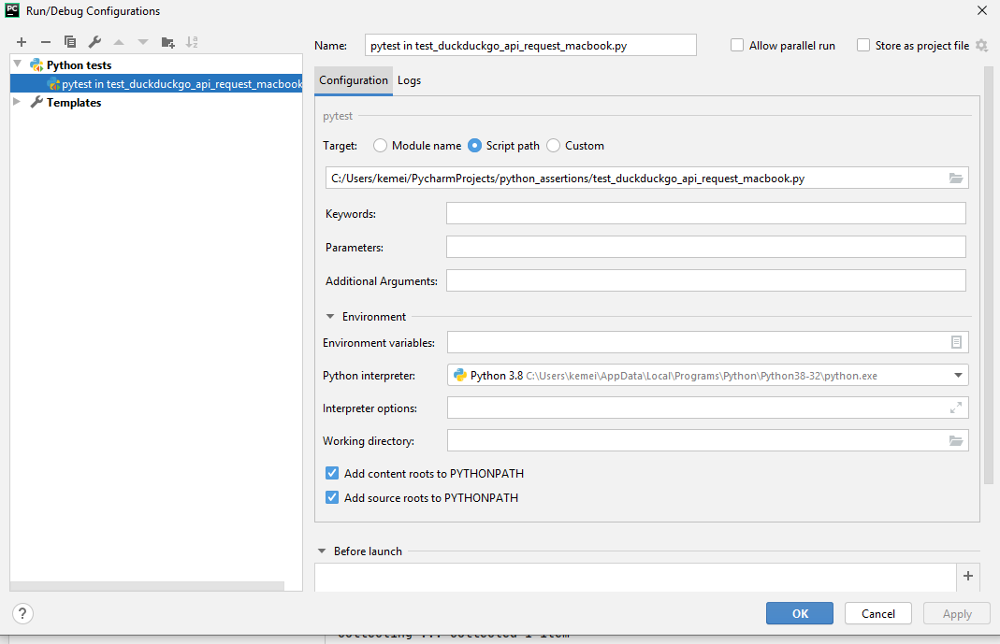
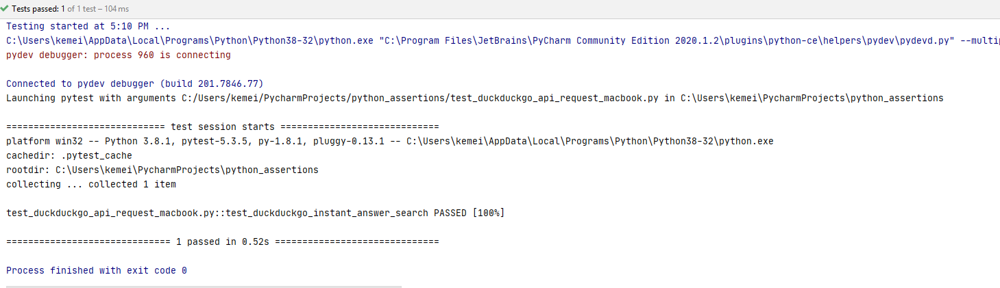

# python_assertions
HOW TO WRITE GOOD TESTS:

I came across the **AAA** (Arrange/Act/Assert) pattern that is used to write unit tests. It ensures a tester writes good tests. I will use it to write an assertion expected outcomes test from DuckDuckGo instant answer API.

*Arrange (inputs and targets):*

Does the test require any objects or special settings (e.g. variables)
Does it need to prep a database
Does it need to login to a webapp
Endpoint URL (base URL & query parameters)

*Act (on the target behavior):*

Call on a function/method (call a function using a variable and store the return value in a variable)
Call on a REST API
Interacting with a web page

*Assert (expected outcomes):*

Should elicit some sort of response that determines if the test passes or fails

PYTHON TEST FRAMEWORKS (pytest, pytest-bdd)
A test framework does not make a test good or bad. As a tester you have to write good tests.
I will use pytest for this example.

For this example, **ChromeDriver** version is 83 and should be located inside your downloads folder ("\\Users\\user_name\\Downloads\\chromedriver_win32\\chromedriver.exe"). Make sure to replace "user_name" with a suitable name from your file path.
Please update it according to your version of Google Chrome installed on your machine when running locally.

**Pre-requisites:**

I am using the [DuckDuckGo instant answer API](https://api.duckduckgo.com/?q=) to search for products like MacBook, iPhone etc. 

Here is a [link](https://github.com/kipkitur/python_assertions/blob/main/test_duckduckgo_api_request_macbook.py) to the script.

**Environment setup:**

Please make sure you have **Python** installed [link](https://www.python.org/downloads/)

Please make sure you have **PyCharm** installed [link](https://www.jetbrains.com/pycharm/download/)

To install the necessary packages using **PyCharm** (on **Windows 10**):

1. Open your project in **PyCharm**.
2. Click on **File -> Settings**.
3. In the search field type in **Interpreter**.
4. In the new window, click on **+** sign to add new packages.
5. Type in **selenium** and click on **Install Package**.
6. Type in **pytest** and click on **Install Package**.
7. Close Packages and Settings windows.
 

Make sure you have the packages installed otherwise you won't be able to import the modules and run your tests.

Edit your Run/Debug configurations so that you can use pytest to run your assertion tests. Click on the **+** icon and select "pytest" under "Python tests". Make sure that you change the target for your script path. It should be the path to the python file that you want to test.

If your test has passed, you will get a message on the console similar to the one below:

You can run your test via terminal. Type **pytest -v filename** or **pytest -v** to run all other tests you have in the folder.
